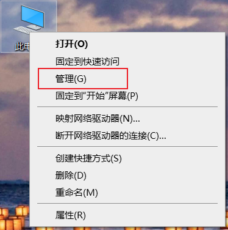
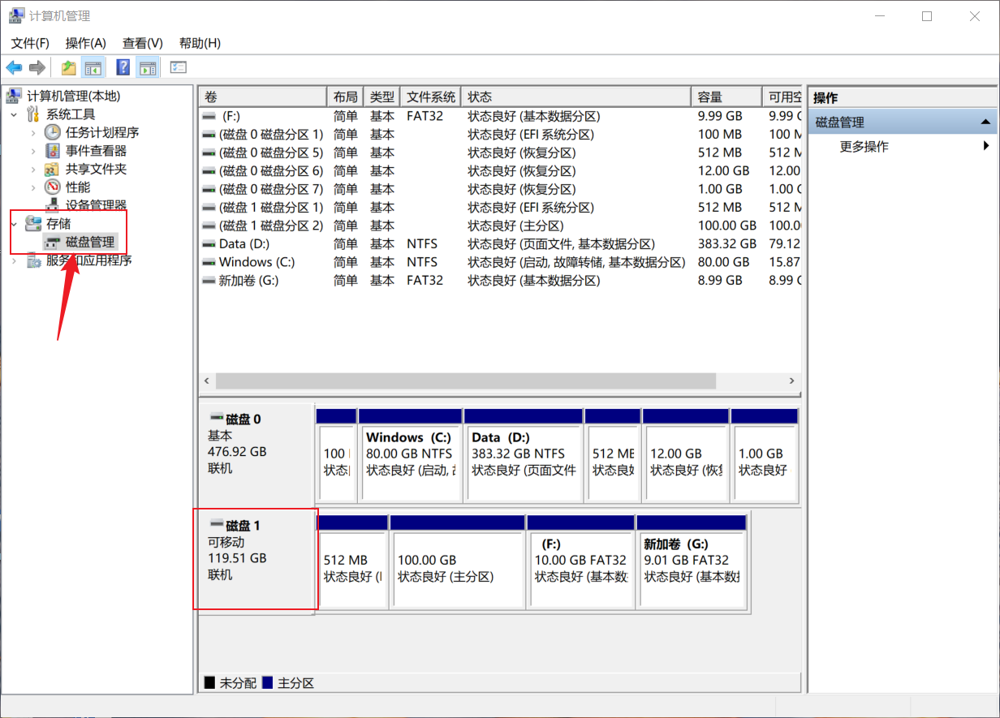
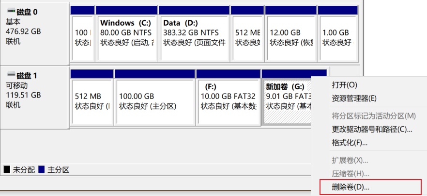
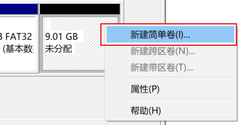
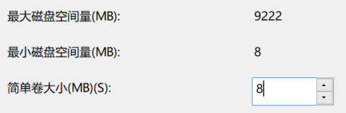
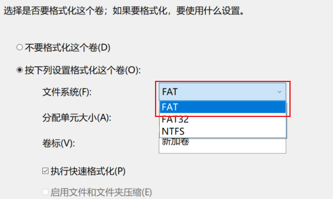

# FAT12

## 课设目的

实现FAT12分区管理的简单程序，功能包括：

- 显示文件列表
- 切换目录
- 创建目录
- 创建文件
- 删除文件/目录

`main.c`中已经完成了命令的输入解析与函数调用。

因此你只需要根据`fs.h`中的函数声明，编写相应的函数定义来完成上述的功能，文件可以自行创建。

如果你有更好的实现方法的话，也欢迎对这些的内容进行修改，我希望它的作用是辅助而不是带来限制。

为了不让这个过程过于坎坷，我会在后面给出一些有用的信息。

## 1. 创建分区

这里建议使用U盘，没有容量要求，毕竟FAT12只能管理8M的空间。

**在格式化之前记得将U盘中重要的数据备份到其他地方**

### Windows

首先右键点击“此电脑”并选择“管理”



接着选择左侧的“磁盘管理”，之后在右边找到你需要创建的分区的存储设备。



如果没有“未分配”空间的话，你可以先选择已有的卷，右键并选择“删除卷”

**删除卷之前，别忘了把里面重要的数据备份到其他磁盘或者分区上**



得到“未分配”空间之后就可以右键，选择新建简单卷



**重点来了**，设置分区大小的时候要选择最小的**8M**，这样后续才能格式化为FAT12。



格式化的文件系统选择**FAT**即可。



### Linux

虽然用Linux的大概也不需要看这个，不过还是简单说明一下。

分区的话可以用命令行工具`fdisk`或`gdisk`，前者用于MBR后者用于GPT，或者也可以用DE自带的GUI分区工具。

FAT12的格式化命令如下：

```bash
mkfs.fat -F 12 $(分区设备名)
```

## 2. 读写磁盘分区数据

### Windows

Windows下*不能*直接用`fopen`这种文件操作的方式打开分区，而是要用到WIN32 API。

不过别慌，我已经把简单封装过函数声明放在了`disk.h`文件中，只需要在文件开头`#include "disk.h"`即可。

函数的声明和用法如下：

#### 打开分区

```C
void disk_open_vol(char vol_name);
```

功能类似于`fopen`，其中的`vol_name`是卷标的意思，也就是分区的C,D,E,F,G...

不过实际使用的时候你并不需要主动调用它，打开分区的操作已经在main函数中完成了。

你只需要修改`main.c`开头的宏定义中的字符即可。

```C
#define VOL_NAME 'h' /* 卷标，根据自己的分区进行调整 */
```

#### 读写分区数据

```C
void disk_read(void *buffer, DWORD offset, DWORD size);
void disk_write(void *buffer, DWORD offset, DWORD size);
```

这两个函数就相当于`fread`和`fwrite`，不过*不需要*用到类似*文件指针*的东西，因为已经封装起来了，这样也能减轻使用时传参的负担。

参数中的`offset`是距离分区起始位置的偏移量，`offset`和`size`都是以**字节**为单位的。

`DWORD`则是windows定义的类型，一般表示32bit的无符号数，其实就是`unsigned long`。

使用样例如下：

```C
#include <stdio.h>
#include "disk.h"

int main()
{
    /*
     * 打开G分区
     * 在课设代码的main函数中已经调用过一次了
     * 所以实际使用的时候不需要再重复打开
     */
    disk_open_vol('g');

    const DWORD SIZE = 233;

    char buff[SIZE];
    DWORD offset = 555;

    for (int i = 0; i < SIZE; i++)
    {
        buff[i] = '0' + (i % 10);
    }

    /*
     * 从分区起始位置偏移555字节处读/写233字节数据
     * 也就是读/写分区中[555-787]字节范围的数据
     */
    disk_write(buff, offset, sizeof buff);
    disk_read(buff, offset, sizeof buff);

    /* 输出 */
    for (int i = 0; i < SIZE; ++i)
    {
        if (i && i % 16 == 0)
            putchar('\n');
        printf("%c ", buff[i]);
    }
}
```

### Linux

Linux就不需要像Windows这么麻烦，你可以直接用文件操作的`fopen`、`fread`、`fwrite`等函数。

只需要在`fopen`时使用分区的设备名打开即可，例如：

```C
FILE *fp = fopen("/dev/sda3", "rw");
```

分区的设备名可以用`lsblk`命令查看。

## 3. 了解FAT文件系统（参考资料）

在开始写代码之前，你需要先了解FAT12文件系统的工作方式。 为了帮助你有一个初步理解，我把一些有价值的参考资料放在了前面。 虽然大部分都是英文，但你可以配合机翻来阅读。

微软官方文档：

+ FAT工作原理（基于Windows Server 2003）：[How FAT Works: Local File Systems | Microsoft Learn](https://learn.microsoft.com/en-us/previous-versions/windows/it-pro/windows-server-2003/cc776720(v=ws.10))

+ FAT硬件白皮书：[FAT32 File System Specification (archive.org)](https://web.archive.org/web/20071013033802/http://www.microsoft.com/whdc/system/platform/firmware/fatgen.mspx)

Wiki：

+ [Design of the FAT file system - Wikipedia](https://en.wikipedia.org/wiki/Design_of_the_FAT_file_system)
+ [文件分配表 - 维基百科，自由的百科全书 (wikipedia.org)](https://zh.wikipedia.org/wiki/檔案配置表)
+ [8.3文件名 - 维基百科，自由的百科全书 (wikipedia.org)](https://zh.wikipedia.org/wiki/8.3文件名)

如果你无法访问后面四个参考资料的链接，可以到目录下的`参考资料`文件夹内查看PDF版。不过用PDF保存下来的Wiki页面格式会有些乱，阅读体验不是很好（悲。

即使上面的参考资料不能满足你的需求，也一定不要忘记，**搜索引擎永远是你的好伙伴**，百度找不到的还可以试试Bing

## 4. FAT卷的组织

FAT卷是由不同的部分按照一定的顺序和规则构成的。在深入了解FAT卷的工作原理之前，要先确保你对FAT卷的组织结构有基本的了解。

下表展示了FAT卷各部分的排列顺序：

| 引导扇区 | 保留扇区 | FAT1 | FAT2 | 根目录 | 数据区 |
| -------- | -------- | ---- | ---- | ------ | ------ |

### 引导扇区

引导扇区处在FAT分区的起始位置，也就是第0扇区，其中包括了MBR引导代码和**BIOS参数块（BIOS Parameter Block）**。

**BIOS参数块（以下简称BPB）**中存储了分区的基本信息，包括但不限于扇区和簇的大小、FAT的数量和大小，以及分区所包含的扇区总数等。

在后续的操作中会需要用到BPB提供的信息来推算各结构的起始位置。

### 数据区

在FAT文件系统中，数据管理的基本单位叫做**簇（Cluster）**。

一个簇由多个连续的扇区组成，而一个扇区又是由多个连续的字节组成。所以一个簇的字节大小 = 簇包含的扇区数 * 扇区包含的字节数。

而**数据区**就可以看作是一个**由簇构成的数组**，这个数组的索引就叫做**簇号**。

值得注意的是，**簇号一般从2开始**。这是因为0和1通常是作为特殊标记，**因此簇号2对应的就是数据区的起始位置。**

### FAT (File Allocation Table)

FAT文件系统的数据存储方式可类比为**链表**，可分为文件数据和“next指针”，而这个“next指针”就是**下一个数据块所在的簇号**。而每个簇号的大小是**12bit（1.5字节）**，这也是FAT12名称的由来。

这些作为“next指针”的簇号与文件数据分离，单独存放在文件分配表（FAT）。因此也可以说FAT是一个**由簇号构成的数组**，并且其索引与数据区是一一对应的关系。

一般情况下磁盘会创建两个FAT（FAT1和FAT2），将FAT2作为FAT1的备份。

此外，FAT中的条目不仅可以表示下一个簇号，还可以用于表示当前簇的状态：

|     FAT12     |           描述           |
| :-----------: | :----------------------: |
|     0x000     |          空闲簇          |
|     0x001     |          保留簇          |
| 0x002 - 0xFEF | 被占用的簇；指向下一个簇 |
| 0xFF0 - 0xFF6 |          保留值          |
| 0xFF8 - 0xFFF |      文件最后一个簇      |
|     0xFF7     |           坏簇           |

> 表格来自 [文件分配表 - 维基百科，自由的百科全书 (wikipedia.org)](https://zh.wikipedia.org/wiki/檔案配置表)

### 根目录区

根目录区是文件系统读取数据的入口，用于保存根目录内的文件条目。

根目录能保存的文件条目数量受到根目录区大小的限制，具体上限可以在BPB中读取到。

根目录区仅用于保存根目录下的条目，其子目录下的内容则是保存在数据区之中。除了“入口”的作用之外，其功能和数据区并没有明显区别。所以后来FAT32也取消了根目录区，转而把根目录保存在数据区之中，并在BPB中添加了根目录在所在的簇号作为新的入口标志。

## 5. 读取BPB

在开始读取分区中各组织的数据之前，我们首先需要知道他们所在的位置，而**BPB**可以为我们提供这些关键信息。

BPB的读取并不难，不过为了方便使用，我还是在main函数中提前完成了这一步。

`disk.h`头文件中包含了一个bpb扩展全局变量的声明，你可以直接在别的文件中访问它。

```C
extern struct bios_pram_block bpb;  /* 可全局访问的BPB */
```

里面的内容经过了适当的简化，只保留了标识符和计算要用的数据，定义如下：

```C
struct bios_pram_block
{
    u16 byte_per_sec;   /* 每个扇区的字节数 */
    u8 sec_per_clus;    /* 每个簇的扇区数 */
    u16 rsvd_sec_cnt;   /* 保留扇区总数(包括引导扇区) */
    u8 num_fats;        /* FAT数量 */
    u16 root_ent_cnt;   /* 根目录条目数量上限 */
    u16 sec_per_fat;    /* 每个FAT占用扇区数 */
    u32 tot_sec;        /* 扇区总数 */
    /* FAT12/16 EPBP */
    u32 vol_id;
    u8 vol_lab[11];
    u8 fs_type[8];
};
```
## 6. 读取FAT

## 7. 读取根目录

## 8. 读取数据区
